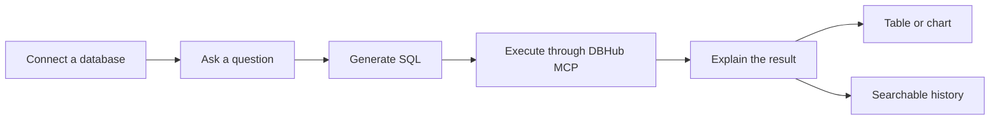

<div align="center">

# Nova

**A local-first AI database assistant that turns plain-language questions into SQL, insights, tables, and charts.**

[Website](https://nova.yiheng.run) · [Releases](https://github.com/guoyiheng/nova/releases/latest) · [Report an issue](https://github.com/guoyiheng/nova/issues)


</div>

<p align="center">
  
</p>

## What is Nova?

Nova is a desktop workspace for exploring databases without losing sight of the SQL behind the answer. Connect a data source, ask a business question in natural language, review the generated query, and inspect the result as a concise explanation, a data table, or a chart.

### Highlights

- **Natural language to SQL** — uses an OpenAI-compatible model and DBHub MCP to translate questions into executable queries.
- **Five database engines** — PostgreSQL, MySQL, MariaDB, SQL Server, and SQLite.
- **Readable results** — combines narrative answers, query details, tables, and visualizations in one workspace.
- **Provider presets** — configure OpenAI, DeepSeek, Qwen, Kimi, GLM, or SiliconFlow with only an API key.
- **Reusable research** — search, pin, and favorite previous queries across multiple data sources.
- **Local-first storage** — application data stays in Electron's local `userData` directory.
- **Encrypted credentials** — database passwords and model API keys are protected with local AES-256-GCM encryption.
- **Cross-platform delivery** — packaged for macOS, Windows, and Linux with update support.

## Workflow



Nova does not force read-only access. The effective permissions are the permissions of the database account you connect, so use a restricted account when working with production data.

## Quick Start

### Install the desktop app

Download the latest build from [GitHub Releases](https://github.com/guoyiheng/nova/releases/latest), then:

1. Add a PostgreSQL, MySQL, MariaDB, SQL Server, or SQLite data source.
2. Configure an OpenAI-compatible model endpoint and API key.
3. Ask a question, inspect the generated SQL, and run the query.

### Run from source

Nova requires Node.js 22.5 or later.

```bash
npm install
npm run dev
```

Validate and package the application:

```bash
npm test
npm run typecheck
npm run build
npm run pack
```

`npm run pack` creates an unpacked application in `release/`; `npm run dist` creates platform installers.

## Project Structure

```text
nova/
├── electron/
│   ├── main/          # Database, agent, storage, and update services
│   ├── preload/       # Secure renderer bridge
│   └── shared/        # Main/renderer contracts
├── src/               # React renderer and query experience
├── build/             # Application icons and packaging hooks
├── docs/              # Release and project documentation
├── scripts/           # Update manifest tooling
└── package.json
```

## Technology Stack

| Layer | Technology |
| --- | --- |
| Desktop runtime | Electron 37 |
| Interface | React 19, TypeScript, Vite |
| Database bridge | DBHub MCP, Model Context Protocol SDK |
| AI client | OpenAI-compatible API |
| Results | React Markdown, Recharts |
| Validation and tests | Zod, Vitest |
| Packaging | electron-builder |

## License

Licensed under the [Apache License 2.0](https://www.apache.org/licenses/LICENSE-2.0).

<p align="center">© 2026 yiheng</p>
